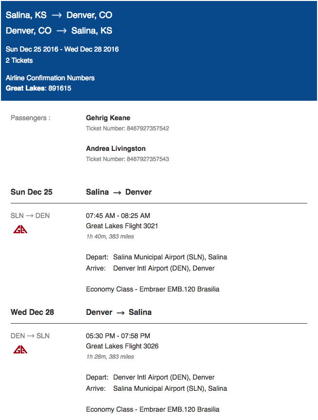

# Welcome Friends and Family!
---

The following web-page covers wedding information for Andrea and I, below you'll find a time-line, directions, and location information. 

Parents, I can't emphasize enough how grateful Andrea and I are for all of the help you've provided bringing our impromptu wedding together. We recognize such spontaneous plans have likely elevated feelings of stress this holiday season, and for that we apologize. We've been searching for wedding scenarios that are true to our relationship for a while now, and the relaxed ceremonies defined below very much resonate with both of us. 

Finally, we'd like to emphasize that the aim for our wedding is relaxed, comfortable, and Family/Friends centric. **Wear what you want!** We'll be dressed all fancy because it's fun, you're more than welcome to follow suit *(\*\*no pun intended\*\*)*, but Christmas sweaters or pajamas are entirely welcome!

## Time-line
---

The following table outlines our general time-line of events. December 24, Thursday is the day of our Wedding! [Directions](#directions) can be found below.

| Date | Time | Description |
| --- | --- | --- |
| Dec. 22, Thursday 	| 12:00PM	| Leave for Wichita	|
| Dec. 23, Friday 	| 12:00PM	| Pick up cakes @ [Artistic Cakes](http://www.artisticcakes.com/) |
| 						| 03:30PM	| Manicure Appointment @ [Ideal Nails](https://www.facebook.com/Ideal-nails-259953634350916/) |
| **Dec. 24, Saturday** | 09:00AM	| Andrea Makeup/Hair @ [Z Salon](http://www.salonzwichita.com/) |
|						| 09:00AM	| Dog drop-off @ Keane Household |
|						| **03:30PM**	| **Arrive at Livingston Household** |
|                       | **03:45PM**   | **Ceremonial Activities, Pictures to follow** |
|                       | **04:40PM**   | **Depart for Dinner** |
|						| **05:00PM**	| **Dinner @** [AVI Seabar & Chophouse](https://www.facebook.com/pg/AVISeabarAndChophouse/about) |
|						| **06:30PM**	| **Dessert @** [AVI Seabar & Chophouse](https://www.facebook.com/pg/AVISeabarAndChophouse/about) |
|						| **07:00PM**	| **Family & Friends Time @** The Bar |
| Dec. 25, Sunday 	| 04:45AM	| Wake up |
|						| 05:40AM	| Check-out @ [Broadview Hotel](https://druryhotels.com/locations/wichita-ks/drury-plaza-hotel-broadview-wichita) (ICT -> KSLN 2hrs) |
|						| 07:45AM	| Depart KSLN for DEN |
|						| 08:25AM	| Arrive in DEN |
|						| 09:00AM	| Pickup rental car @ [Advantage](https://www.advantage.com/location/denver-intl-airport-den) (DEN -> Estes Park 2hrs) |
|						| 03:00PM	| (Earliest) Check-in @ [Mary's Lake Lodge](http://www.maryslakelodge.com/) |
| Dec. 26 - Dec. 27 	|			| Estes Park Vacation |
| Dec. 28, Wednesday 	| 11:00AM	| (Latest) Check-out @ [Mary's Lake Lodge](http://www.maryslakelodge.com/) |
|						| 05:30PM	| Depart DEN for KSLN |
|						| 08:00PM	| Arrive in KSLN |
|						| 10:00PM	| Arrive in Wichita |
| Dec. 29 - Jan. 1  	|			| Wichita Vacation |
| Jan. 2, Monday    	| 07:00AM	| Leave for Madison |

## Directions
---

### Livingston Household - Ceremony Location

Our vision of the ceremonies is as follows: Arrival at the Livingston residence around 3:30PM. Loose socialization and hors d'oeuvres until everyone arrives and has been introduced. Around 3:45PM Andrea and I will announce our thanks to everyone in attendance, and then recite our vows to one another. Proceeding vows we'll sign the marriage license and begin pictures! Finally, after the mothers are sated we'll depart for Dinner!

**Address:** 11414 West Lost Creek Circle, Wichita, KS

<iframe src="https://www.google.com/maps/embed?pb=!1m18!1m12!1m3!1d3156.8140776803607!2d-97.47771194848228!3d37.70056522409803!2m3!1f0!2f0!3f0!3m2!1i1024!2i768!4f13.1!3m3!1m2!1s0x87badfac9888d301%3A0xae6b3380f710673!2s11414+W+Lost+Creek+Cir%2C+Wichita%2C+KS+67212!5e0!3m2!1sen!2sus!4v1482080616580" width="600" height="450" frameborder="0" style="border:0" markdown="0" allowfullscreen></iframe>

### [AVI Seabar & Chophouse](https://www.facebook.com/pg/AVISeabarAndChophouse/about)

We've reserved a separate dining area in the chophouse, just inform the wait staff you're there for the wedding dinner in the private room. The full menu is available and cheese cake will be served when I give the word (*Note: only when I give the word*). Parking is available just north of the Broadview hotel or in the parking garage directly to the east.

<iframe src="https://www.google.com/maps/embed?pb=!1m18!1m12!1m3!1d3157.4212009820167!2d-97.34464994848254!3d37.68630602491708!2m3!1f0!2f0!3f0!3m2!1i1024!2i768!4f13.1!3m3!1m2!1s0x87bae3dd5c526445%3A0xa2dd735156945130!2sAVI+Seabar+%26+Chophouse!5e0!3m2!1sen!2sus!4v1482081469728" width="600" height="450" frameborder="0" style="border:0" markdown="0" allowfullscreen></iframe>

### [Artistic Cakes](http://www.artisticcakes.com/)

We've ordered 3 delicious cheese cakes under Andrea's name. They're scheduled to be ready for pick-up on Dec. 23 at 12:00PM.

[Map](https://www.google.com/maps/place/Artistic+Cakes/@37.6926718,-97.4494267,17z/data=!3m1!4b1!4m5!3m4!1s0x87bade2f00ad2ef3:0xa34ba36404a498dd!8m2!3d37.6926676!4d-97.447238)

### [Ideal Nails](https://www.facebook.com/Ideal-nails-259953634350916/)

Andrea wants to get her nails done with Paula on Thursday Dec. 23 at 3:30PM. Ideal Nails' lacquered finish lasted for nearly two weeks in the Wyoming Rockies! Hence the repeat business.

[Map](https://www.google.com/maps/place/Ideal+Nails/@37.7087972,-97.3747467,17z/data=!3m1!4b1!4m5!3m4!1s0x87bae19f7085b2e1:0x23d18f1f3da9ea46!8m2!3d37.708793!4d-97.372558)

### [Salon Z](http://www.salonzwichita.com/)

Andrea's scheduled for her hair and makeup appointment at Salon Z on Dec. 24 at 9:00AM. I don't know anything about this place ... here's a map:

[Map](https://www.google.com/maps/place/SalonZ/@37.6934681,-97.4268722,17z/data=!3m1!4b1!4m5!3m4!1s0x87bae08fb4a143df:0xaeb188e2a2ed08ba!8m2!3d37.6934639!4d-97.4246835)

### Keane Household - In case you need this for whatever reason

<iframe src="https://www.google.com/maps/embed?pb=!1m18!1m12!1m3!1d789.0977847436645!2d-97.3845940118539!3d37.710495859692934!2m3!1f0!2f0!3f0!3m2!1i1024!2i768!4f13.1!3m3!1m2!1s0x87bae1a5ff67663d%3A0x415e7c79c08b18e!2s1461+N+High%2C+Wichita%2C+KS+67203!5e0!3m2!1sen!2sus!4v1482035371926" width="600" height="450" frameborder="0" style="border:0" markdown="0" allowfullscreen></iframe>

## Our Travel Information - This is for our reference
---

### [Advantage Rental Car](https://www.advantage.com/location/denver-intl-airport-den)

Pickup Information

* Take the train to the main terminal. Take the Advantage courtesy shuttle bus to the Rental Car Facility. The courtesy bus stops outside the baggage claim area on the East and West side at Island 4. The courtesy bus runs every 8-10 minutes.

[Map](https://www.google.com/maps/place/Advantage+Rent+A+Car/@39.8366064,-104.7127227,17z/data=!3m1!4b1!4m5!3m4!1s0x0:0x661a262144364a9d!8m2!3d39.8366023!4d-104.7105338)

### [Mary's Lake Lodge](http://www.maryslakelodge.com/)

If you need to reach us for whatever reason and our phones aren't working, here's the information for our hotel in Estes Park.

[Map](https://www.google.com/maps/place/Mary's+Lake+Lodge/@40.3378311,-105.5335863,17z/data=!3m1!4b1!4m5!3m4!1s0x8769644f13754335:0xd77ba3824509023e!8m2!3d40.337827!4d-105.5313976)

